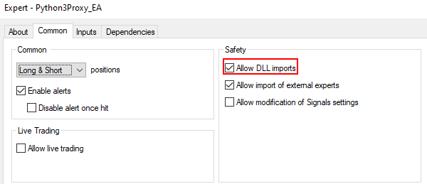
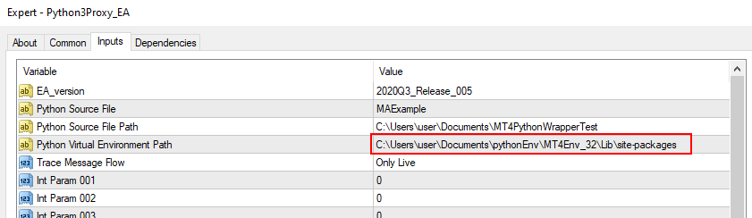

# MT4PY3Wrapper
This wrapper provides a communication between MT4 and Python 3

# Installation
Download the latest version from [here](https://github.com/dcitdev/MT4PY3Wrapper/releases)
Currently we support python 3.9

- Install software
  - Python3Proxy_EA.ex4
    - Put this under folder MQL4/Experts
  - MT4PY3Wrapper.dll
    - Put this under folder MQL4/Libraries
  - python39.dll
    - Put this under folder MQL4/Libraries
  - Install python libraries
    - pip install DCMT4Lib

- Install python
  - [Install python 3.9](https://www.python.org/downloads/release/python-399/)
  - Please add the python to your environment Path
- Prepare the virtual python environment
```
# Bring up cmd.exe
$ pip install virtualenv
$ cd Path_To_Your_virtualenv
$ virtualenv PY3_MT4_env
$ C:\Path_To_Your_virtualenv\PY3_MT4_env\Scripts\activate.bat
```

# How to use
After the installation


- You need to enable dll


- You need to select the correct virtual environment

# Functions we are supporting
| Category      | Status |
| ----------- | ----------- |
| Account Information      | Support       |
| Chart Operations   | Support        |
| Checkup | Support |
| Conversion | Support |
| Date and Time | Support |
| Object | Support |
| Predefined Variables | Support |
| Technical Indeicators | Support |
| Trade | Support |
